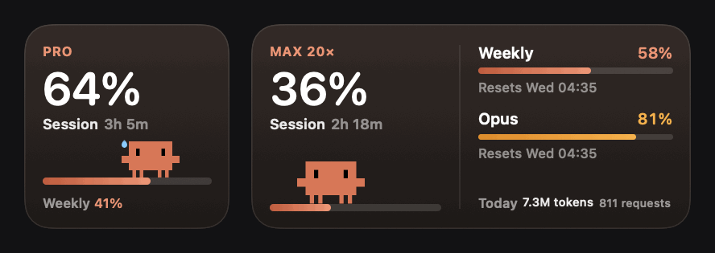
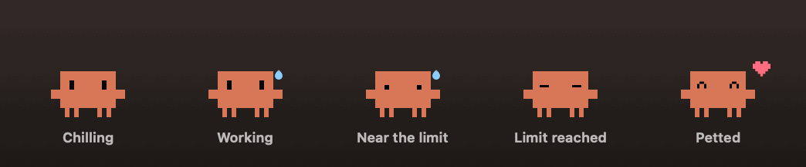
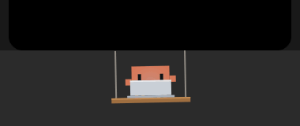
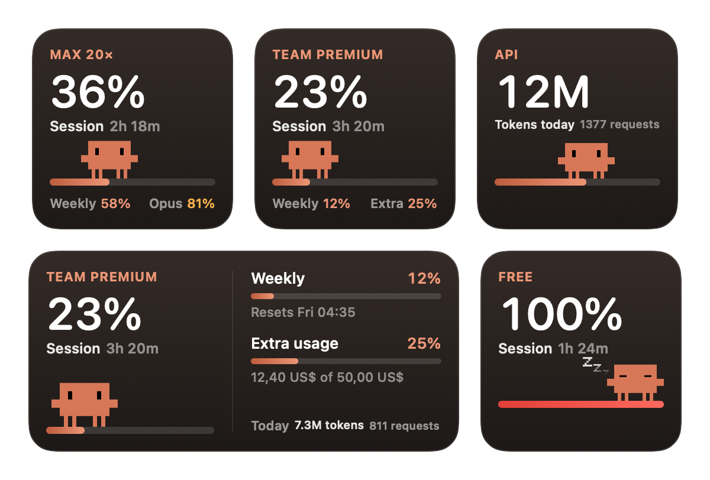

<p align="center">
  
</p>

<h1 align="center">Clawdmeter</h1>

<p align="center">
  Your Claude plan usage on the desktop, with Clawd walking along the meter.<br>
  A little Clawd under your notch that works whenever Claude does, on Windows and on your iPhone too.
</p>

<p align="center">
  <a href="https://github.com/pavliukovbr/clawdmeter/releases/latest"><b>Download for Mac</b></a> · <a href="https://github.com/pavliukovbr/clawdmeter/releases/latest"><b>Download for Windows</b></a> · <a href="#on-your-iphone"><b>Install on iPhone</b></a> · <a href="#ask-your-claude-to-install-it"><b>Ask your Claude to install it</b></a>
</p>

## Desktop widget

- **Session**: how much of your current 5 hour window is used and when it resets.
- **Weekly**: your weekly limit, plus model limits like Opus when your plan has them.
- **Extra usage**: spend against your monthly cap, if extra usage is turned on.
- **Today**: tokens and requests from your Claude Code sessions, with a 7 day chart.

It comes in a square and a wide size. Clawd stands on the usage bar and walks along it as your session fills up. It looks around, blinks, types faster when things get busy, sweats near a limit and naps once the limit is reached. Click Clawd for a heart and fresh numbers.

<p align="center">
  
</p>

## Clawd in the notch

<p align="center">
  
</p>

Clawd hangs out right under the notch and shows what is going on:

- Types on a tiny laptop while Claude edits files or you are typing
- Reads a book while Claude reads your code, or when a PDF or ebook is in front
- Searches with a magnifying glass while Claude browses the web, or when you are in a browser
- Puts on a hard hat and hammers away while Claude runs commands
- Thinks while Claude is working out the next step, and waves when it is done
- Sleeps in a hammock when you are away or a limit is reached
- Peeks out from behind the notch every now and then

Move the pointer close and Clawd hides behind the notch so nothing underneath is blocked. It stays out of full screen apps. On Macs without a notch it hangs from the middle of the menu bar instead. You can turn it off from the menu bar.

## Clawd on your desktop

Turn on **Clawd Walks Around** and Clawd leaves the notch now and then:

- Walks out onto the menu bar next to the notch, looks around and hops down
- Lands on top of your windows, rides along when you drag them and falls when they close
- Jumps between windows and wanders toward the pointer
- Pretends to be things on your screen: a folder, a fourth window button, and every so often something in the top left corner of the menu bar
- Gets a heart when you rest the pointer on him
- Heads back into the notch when Claude gets to work, and comes out again once it is quiet

There is only ever one Clawd, so the notch stays empty while he is out. Mention the right names to Claude and you might get a surprise or two.

## Notifications

With **Notify When Claude Finishes** on, the Mac lets you know when Claude wraps up something that took more than 20 seconds, with the project name and how long it took. The iPhone app shows the same news as a banner while it is open.

## Keep Mac awake

Leaving Claude on a long task, or driving it remotely? Clawdmeter can keep the Mac from going to sleep:

- **While Claude Works** keeps it awake while Claude is busy and for ten minutes after
- **Always** keeps it awake until you turn it off
- **Keep Display On** stops the screen from sleeping too

The Mac still sleeps when the lid is closed, unless it is connected to an external display.

## iPhone

Clawdmeter comes to the iPhone too: widgets on the Home Screen, a ring and a bar on the Lock Screen, a big Clawd in StandBy and Clawd in the Dynamic Island.

The iPhone never signs in to Claude. Your Mac shares the summary with it:

1. On the Mac, open Clawdmeter in the menu bar and turn on **Share with iPhone**.
2. Scan the code with the iPhone Camera and open the link.
3. To keep it working away from home, install [Tailscale](https://tailscale.com) on the Mac and the iPhone with the same account. The iPhone picks up the new address by itself.

Every request is signed and every reply is encrypted with a key only your Mac and iPhone know, so nothing readable crosses the network. When the Mac cannot be reached, the iPhone keeps showing the last numbers and the countdowns keep running.

The Dynamic Island follows your session while it is on. It updates whenever the app refreshes, and iOS ends it after 8 hours.

To put it on your iPhone, follow [the iPhone steps](#on-your-iphone) or [ask your Claude to install it](#ask-your-claude-to-install-it).

## Windows

Clawdmeter runs on Windows 10 and 11 as well, reading the same Claude Code sign in from your PC.

- A small panel on the desktop with your session, weekly and model limits, the same meters as the Mac widget
- An icon in the notification area: click it to show or hide the panel, right click it for the settings
- Clawd walks along the top edges of your windows, rides them when you drag them and falls when they close
- He lives on the taskbar near the clock instead of a notch, and climbs back there when Claude gets to work
- He pretends to be a folder, an extra window button, or the logo on the Start button
- Keep the PC awake while Claude works, open at login, and the same alert when Claude finishes

Drag the panel anywhere, it stays where you leave it. Everything can be turned off from the menu.

### An old phone as a second screen

Have a phone gathering dust? Turn on **Screen on an old phone** and the PC serves a small page on your home network with the big number, the bars, the countdown and Clawd walking along the bottom. Pick **Show the phone address**, open it on the phone and leave it there.

It is built for old browsers, so even a phone from 2011 keeps it on screen. On an iPhone use **Share** and **Add to Home Screen** to lose the browser bars, set **Auto Lock** to **Never** and leave it charging. The page turns itself sideways when the phone is upright, so it reads the same either way.

The page only answers phones on your own network and only with the key that is part of the address, it listens on port 47848, and it is off until you turn it on.

## Works with every plan

Clawdmeter detects your plan and adapts on its own.

- **Free**: session limit
- **Pro**: session and weekly limits
- **Max 5× and Max 20×**: session, weekly and model limits
- **Team and Enterprise**: seat limits and extra usage spend
- **API key**: tokens today and a 7 day chart

<p align="center">
  
</p>

## Install

### On your Mac

1. Download **Clawdmeter.dmg** from the [latest release](https://github.com/pavliukovbr/clawdmeter/releases/latest).
2. Open it and drag Clawdmeter to Applications.
3. Open Clawdmeter. It is not notarized by Apple, so the first time macOS asks: go to **System Settings > Privacy & Security**, scroll down and click **Open Anyway**.
4. Right click the desktop, choose **Edit Widgets**, search for Clawdmeter and drag the size you like.

You need macOS 14 Sonoma or later, on Apple silicon or Intel, and Claude Code signed in on the same Mac. From then on Clawdmeter updates itself.

### On your PC

1. Download **Clawdmeter-Windows.zip** from the [latest release](https://github.com/pavliukovbr/clawdmeter/releases/latest).
2. Unzip it anywhere you like and run **Clawdmeter.exe**. Nothing to install, the app carries what it needs.
3. Windows warns about an unknown publisher the first time, since the app is not signed yet. Click **More info** and **Run anyway**.
4. Turn on **Open at login** from the icon in the notification area to have it start with the PC.

You need Windows 10 or 11 on 64 bit, and Claude Code signed in on the same PC. From then on Clawdmeter updates itself.

### On your iPhone

The iPhone app is installed from your Mac with Xcode. A free Apple ID is enough.

1. Install **Xcode** from the Mac App Store, open it and add your Apple ID in **Settings > Accounts**.
2. Connect the iPhone with a cable and tap **Trust**. On the iPhone, turn on **Settings > Privacy & Security > Developer Mode** and let it restart.
3. Download this project with **Code > Download ZIP** on this page, unzip it and open `Clawdmeter.xcodeproj`.
4. Select the project, then under **Signing & Capabilities** pick your team for **ClawdmeterPhone** and for **ClawdmeterPhoneWidget**.
5. At the top of the window choose **ClawdmeterPhone** and your iPhone, then press **Run**.
6. On the iPhone, open **Settings > General > VPN & Device Management**, tap your Apple ID and tap **Trust**. Open Clawdmeter.
7. On the Mac, turn on **Share with iPhone** in the Clawdmeter menu and scan the code with the iPhone Camera.

With a free Apple ID the app stops opening after 7 days. Connect the iPhone and press Run again to renew it. If Xcode says the bundle identifier is not available, change `CLAWDMETER_BUNDLE_PREFIX` in the project build settings to something of your own.

### Ask your Claude to install it

Using Claude Code? Paste this and let it do the work. It will still ask you for the few things only you can do, like signing in to Xcode or tapping Trust on the iPhone.

```text
Please install Clawdmeter for me from https://github.com/pavliukovbr/clawdmeter

Mac
1. Download Clawdmeter.dmg from the latest release, copy Clawdmeter.app into /Applications and open it.
2. If macOS blocks it, tell me to click Open Anyway in System Settings > Privacy & Security.
3. Tell me how to add the widget: right click the desktop, choose Edit Widgets and search for Clawdmeter.

iPhone (ask me first if I want it)
1. Check that Xcode is installed and that I am signed in with my Apple ID in Xcode > Settings > Accounts. If not, stop and tell me what to do.
2. Clone the repository and find my iPhone connected by cable with xcrun devicectl. Check that Developer Mode is on.
3. Read my team ID from the Xcode preferences, then build the ClawdmeterPhone scheme for that iPhone with xcodebuild, passing DEVELOPMENT_TEAM and -allowProvisioningUpdates on the command line. Do not change the project file.
4. If the bundle identifier is not available, add CLAWDMETER_BUNDLE_PREFIX set to something unique to that same command.
5. Install and open the app on the iPhone with xcrun devicectl. If it does not open, tell me to trust my Apple ID in Settings > General > VPN & Device Management, then try again.
6. Tell me to turn on Share with iPhone in the Clawdmeter menu on the Mac and scan the code with the iPhone Camera.

Never ask for or type my passwords, and never show my Claude sign in or any token.
```

## Build it yourself

You need Xcode 26 or later. The project has no dependencies and signs itself to run locally, so no developer account is needed.

```bash
git clone https://github.com/pavliukovbr/clawdmeter.git
```

```bash
cd clawdmeter
```

```bash
xcodebuild -project Clawdmeter.xcodeproj -scheme Clawdmeter -configuration Release -derivedDataPath build
```

```bash
cp -R build/Build/Products/Release/Clawdmeter.app /Applications/
```

Or open `Clawdmeter.xcodeproj` and press Run. To make the downloadable files for a release, run `scripts/release.sh`.

For Windows you need the [.NET 9 SDK](https://dotnet.microsoft.com/download), and it builds from Windows, macOS or Linux:

```bash
dotnet publish windows/Clawdmeter/Clawdmeter.csproj -c Release -r win-x64 --self-contained true -p:PublishSingleFile=true
```

To make the downloadable file for a release, run `scripts/release-windows.sh`.

The project is organized in a few folders:

- `App` is the menu bar app: reading usage, the notch scene, keep awake, updates and sharing with iPhone.
- `Widget` is the Mac widget extension.
- `iPhone` and `iPhoneWidget` are the iPhone app, its widgets and the Live Activity, with `PhoneShared` between them.
- `Shared` has the views, models and the pairing protocol used everywhere.
- `windows` is the Windows app, written in C# with WPF and no dependencies.

## How it works

Clawdmeter runs quietly in the menu bar. Every 5 minutes, after waking from sleep, and whenever you click Clawd, it:

1. Reads the sign in Claude Code already keeps in your login keychain, or in the Windows credential manager.
2. Asks Anthropic for your current limits, the same numbers you see with `/usage`.
3. Adds up tokens from the Claude Code session logs in `~/.claude/projects`.
4. Saves a small summary for the widget and asks it to redraw.

Widgets on macOS are drawn ahead of time, so regular animations do not run in them. Clawd moves with the same clock driven rotation Apple uses for clock hands, combined into bobbing, blinking and floating z's. The notch scene uses Core Animation, so it keeps going smoothly with the app idle.

## Privacy

Clawdmeter keeps everything on your own devices.

- **Your sign in** stays in memory and is only sent to `api.anthropic.com` to ask for your limits.
- **Session logs** are read on your Mac. Only token counts, tool names, timestamps and the project folder name are looked at. Prompts are only checked for a couple of easter egg words, and nothing from them is kept.
- **Your windows** are only measured, so Clawd knows where he can stand. What is inside them is never looked at, and no screen recording permission is needed.
- **What you do** is limited to which app is in front and how long ago a key was pressed. Which keys you press is never known.
- **What is saved** is one small file in `~/Library/Application Support/Clawdmeter`, or in `%APPDATA%\Clawdmeter` on Windows, with percentages, reset times and daily totals, readable only by you.
- **The screen for an old phone** is off until you turn it on. It answers only addresses on your own network, only with the key in the address, and it sends percentages and counts, never your logs or your sign in.
- **Sharing with iPhone** is off until you turn it on. The Mac only answers phones paired with its code, replies are encrypted, and the port closes when you turn it off. Reset the code any time to unpair every phone.
- **The iPhone** keeps the pairing and the last numbers in its keychain. It never gets your Claude sign in.
- **Updates** come from the public release list of this repository on GitHub. Nothing about you or your Mac is sent.

There is no analytics, no tracking and no account.

## Good to know

- If you have not used Claude Code for a while its sign in can expire. Run any Claude Code command and the widget catches up on the next refresh.
- The usage endpoint is the one Claude Code uses internally. It is not a public API and could change.
- Widgets on a dimmed desktop keep Clawd still, since macOS does not animate them there.
- Closed the menu bar icon by accident? Open Clawdmeter again and it comes back.
- Sharing with iPhone listens on port 47847, and is a Mac feature for now.
- The screen for an old phone listens on port 47848, and is a Windows feature for now. Windows asks to allow it through the firewall the first time.
- The Windows app is not code signed, so SmartScreen warns the first time you run it.

## License

MIT. Clawdmeter is a fan project and is not affiliated with Anthropic. Claude and Clawd belong to Anthropic.
